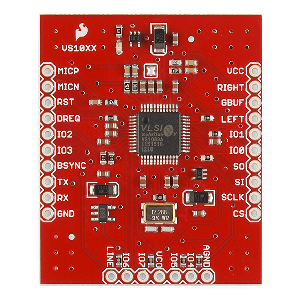

# Replica Sparkfun VS1053
En el siguiente trabajo se busca aprender y poner en práctica conocimientos de diseño de circuitos impresos utilizando herramienta Kicad.

* Autor: Jorge Salvador Muñoz
* jorgesmunoz@gmail.com
* Github: jorgesmunoz
* tpfinal-jorgesmunoz created by GitHub Classroom

Placa a replicar del fabricante

